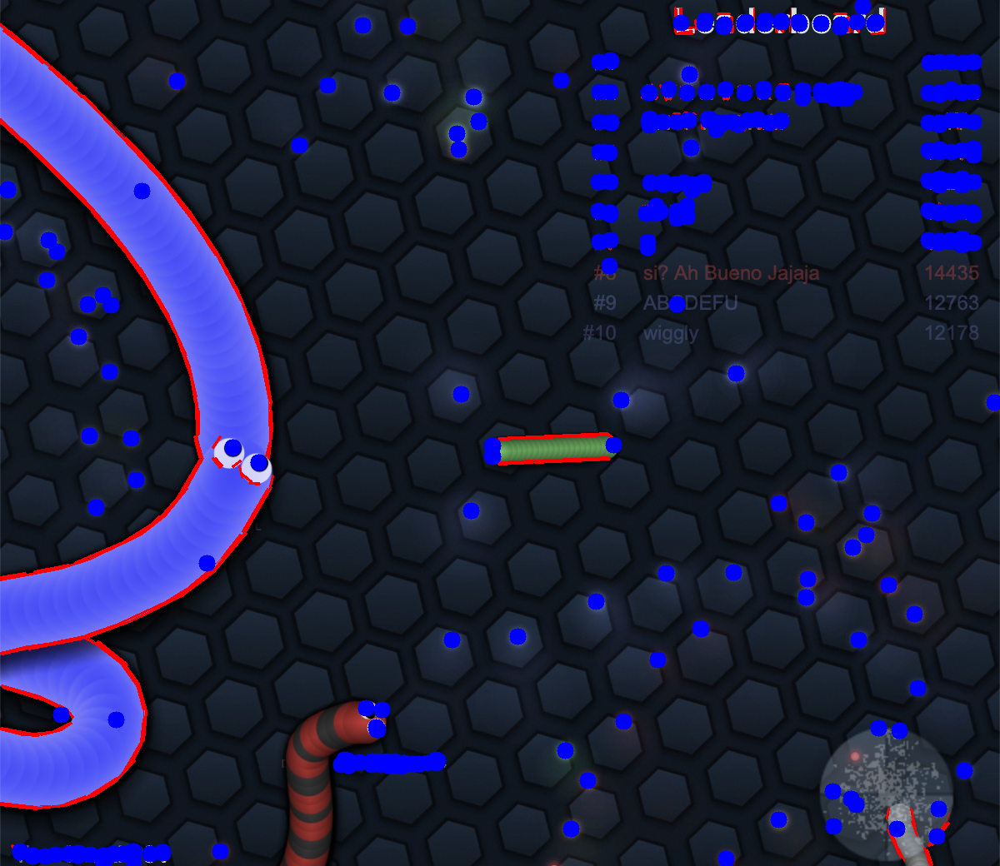
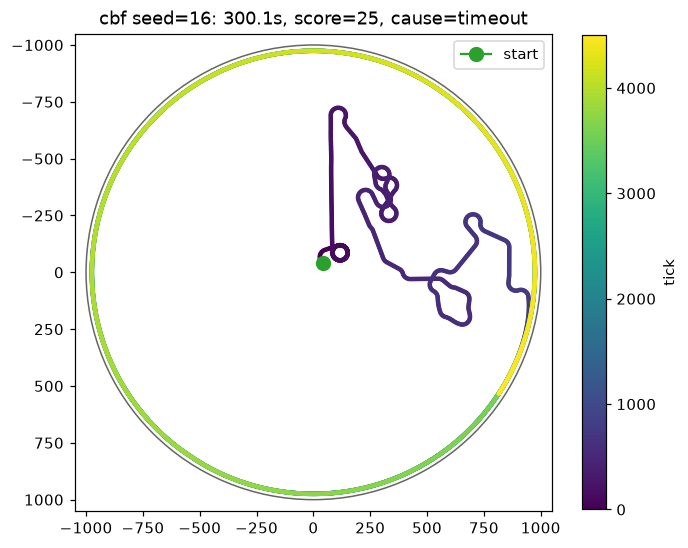
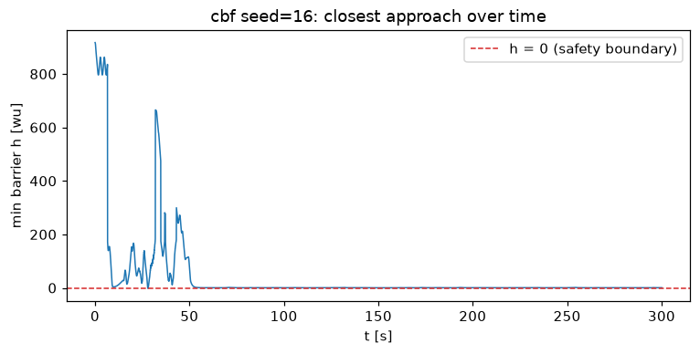

# slither-io-bot

A robotics path-planning experiment on [slither.io](http://slither.io): can the
classical safe-navigation toolbox — **Artificial Potential Fields** and
**Control Barrier Functions** — keep a snake alive in a real, adversarial,
constant-speed game?

This started as a grad-school path-planning final project (the 2022 prototype
is preserved unchanged in [`legacy/`](legacy/)): a Safari window, screenshots
at 1 Hz, line detection as enemy perception, and a random-walk pilot. The CBF
planner it was building toward was never finished. This repo completes it:
exact JS game-state perception, a CBF-QP safety filter with an
executable-heading projection, a finished APF baseline, an offline simulator,
and a measured comparison.


*The original 2022 perception: red = detected line segments ("enemies"), blue =
detected pellets. It fires on the hex background, the UI text, and the bot's own
body — the motivation for reading the game's memory instead.*

## Results (20 episodes per planner, paired seeds, 300 s cap, simulator)

| planner  | survival mean [s] | median [s] | timeouts | score mean | deaths (cause)     |
|----------|-------------------|------------|----------|------------|--------------------|
| random   |              11.7 |        6.5 |       0% |        1.1 | enemy: 19, wall: 1 |
| apf      |              94.2 |       33.9 |      15% |       18.8 | enemy: 17          |
| **cbf**  |         **236.2** |  **300.1** |  **75%** |   **23.9** | enemy: 5           |

Every planner faces the identical worlds (same seeds → same spawns, enemies,
food), so the differences are the planner. The CBF pilot's **median episode
hits the time cap**; three quarters of its episodes never end. Reproduce with
one command — see [Quickstart](#quickstart).

<p>


</p>

*Median CBF episode. Left: trajectory (color = time; it survives the full 300 s
— note the emergent rim-riding late in the episode). Right: the minimum barrier
value h staying above the h = 0 safety boundary.*

## The problem

slither.io is a nice miniature of a hard robotics setting:

- the vehicle moves at **constant speed** — it can steer (bounded turn rate)
  but never brake;
- obstacles are the **moving bodies of other snakes**; touching any of them,
  or the arena wall, is instant death;
- the goal (food) is scattered among the obstacles;
- there is no official API: the game must be *sensed*.

## Perception: how the bot sees enemies

Three approaches, in increasing order of fidelity — the first two live in this
repo, the third is future work:

1. **Pixels (2022 prototype, kept as the degraded fallback).** Screenshot →
   Canny edges → line segments (now `cv2.HoughLinesP`; the original used the
   dead `pylsd`) → "lines are enemies", contours → "small blobs are food".
   Cheap, but it cannot tell enemies from the background hex grid, the
   leaderboard, or your own body, and it sees neither velocities nor the map
   boundary. `slither_bot/live/vision_backend.py`.
2. **JS game-state extraction (the primary backend).** The slither.io client
   keeps its entire world state in browser globals — `window.snakes` (every
   snake with position, heading, speed, scale, and body points),
   `window.foods`, `window.grd` (map geometry), `window.playing`. One
   `execute_script` round-trip (~a few ms) returns exact, labeled state at
   15+ Hz, and writing `window.xm/ym` steers the snake — no OS mouse, no
   clicking (the 2022 bot double-clicked every move, which reads as boost and
   burns mass). `slither_bot/live/js_bridge.py` holds every snippet and global
   name in one file; `python -m slither_bot probe` verifies them at runtime
   and scans for replacements if the client ever renames things.
3. **WebSocket protocol client (future work).** The game protocol has been
   reverse-engineered by the community; a headless client could skip the
   browser entirely.

## The planners

All planners consume the same `Percept` (positions in world units, y-down) and
emit a heading; they are backend-agnostic, so they run identically in the
simulator and the live game. APF and CBF share the same food-targeting and the
same obstacle preprocessing (segment culling within an influence radius,
nearest-K cap) — the experiment isolates the *safety mechanism*.

### Random (the 2022 baseline)

A uniform random heading, held for ~1 s. Survives 11.7 s on average, which
says more about slither.io than about the planner.

### Artificial Potential Fields

Steer down the gradient of a potential `U = U_att + U_rep`:

```
F_att = k_att (g − p)                                    (bounded beyond d_sat)
F_rep = η (1/d − 1/d_inf) (1/d²) · ∇d                    (for clearance d < d_inf)
heading = atan2(Σ F)
```

with `g` the food target, `d` the clearance to each nearby enemy segment
(plus one same-form term for the wall). The 2022 code had the attraction sign
inverted — it climbed the potential, steering *away* from food — and mixed two
coordinate frames; this is a reimplementation. APF's textbook pathologies
(local minima, oscillation between competing gradients) are deliberately kept:
they are what the CBF comparison is about.

### Control Barrier Functions (the centerpiece)

For every nearby enemy body segment define a barrier — its clearance:

```
h_i(p) = dist(p, segment_i) − (r_self + r_enemy + margin)        h_i ≥ 0 ⇔ safe
```

CBF theory: if the control keeps `ḣ_i ≥ −γ h_i` for all i, the safe set
`{h_i ≥ 0}` is forward-invariant — barriers may be approached but never
crossed. For our single-integrator model `ṗ = u`, `ḣ_i = ∇h_i · (u − v_i)`
(`v_i` is the obstacle's velocity — nonzero for the head-adjacent segments of
each enemy, which translate with the head; deeper body points trace the head's
old path and are static). The arena wall contributes one more row,
`h_wall = R − ‖p − c‖ − r_self − margin`.

**Stage 1 — the CBF-QP.** Filter the nominal food-seeking velocity `u_nom`
through a tiny quadratic program over `z = [uₓ, u_y, δ]`:

```
minimize    ½‖u − u_nom‖² + ½ρδ²
subject to  ∇h_i·u + δ ≥ −γ h_i + ∇h_i·v_i        (one row per segment + wall)
            |uₓ|, |u_y| ≤ v                        (box speed bound)
            δ ≥ 0                                  (shared slack)
```

The slack keeps the QP feasible even when surrounded (ρ is large, so it only
activates under genuine conflict). Solved exactly in microseconds by
`quadprog` (dense active-set); 3 variables, ≤ ~45 rows after culling.

**Stage 2 — the constant-speed projection.** The QP's favorite move is to
*slow down* — and the snake can't. Executed control is always `v·e(θ)`, so a
braking answer, followed naively, drills into obstacles at full speed (the
simulator found this within minutes; the first closed-loop CBF run survived
4 s). But at fixed speed each CBF row becomes an **allowed arc of headings**:

```
∇h_i·(v e(θ) − v_i) ≥ −γ h_i    ⇔    cos(θ − φ_i) ≥ b_i / v
```

The bot commands the heading inside the intersection of arcs closest to the
QP's direction — the QP acts as the preference — with two practical guards
found through closed-loop testing: *hysteresis* (a penalty for abandoning the
last command, since a memoryless nearest-arc rule flip-flops between the two
sides of an obstacle and every flip costs a slow turn-rate-limited swing) and
an *urgency mode* (when `h_min` is critically low, escape from the currently
executed heading — the escape the snake can actually reach fastest). If no
heading is arc-feasible, it takes the max-margin one.

Parameters are expressed in units of the bot's own body radius and seconds
(`margin = 1.5 r`, `d_influence = 20 r`, `γ = 1.0 s⁻¹`, …), so the same
numbers transfer between the simulator and the live game. All are tunable:
`--param gamma=1.5`.

**Honest limitations.** The single-integrator model ignores the bounded turn
rate (a proper treatment is a higher-order CBF — future work); the margin and
the early activation radius absorb the mismatch, and the simulator enforces
the real turn limit so tuning sees it. The 5 remaining enemy deaths in the
table are mostly spawn ambushes where the feasible arc set flips sides faster
than the snake can swing — a one-step-horizon planner has no answer to a
closing pocket. And a subtle emergent behavior: late in long episodes the
survival-optimal policy discovers rim-riding (orbiting just inside the wall,
where enemies rarely visit) at some cost in food intake.

## The simulator

The dev environment for this work could not reach slither.io at all, which
forced a good habit: `slither_bot/sim/` is a small seeded slither-like world —
constant speed, **real turn-rate clamp**, waypoint-walking enemy snakes with
trailing bodies, respawning food, wall/enemy death causes — behind the same
`Percept`/`Action` interface as the live backend. Same seed → bit-identical
episode. All tuning and the results table above come from it; the live game
is the field test.

## Quickstart

Python 3.10–3.13.

```bash
python3 -m venv .venv && . .venv/bin/activate
pip install -r requirements.txt -r requirements-dev.txt
python -m pytest -q                                    # 73 tests, all offline

# watch one CBF episode in the simulator (writes trajectory + h_min PNGs)
python -m slither_bot run --backend sim --planner cbf --seed 3 --render --out results/

# watch it THINK: live side window with the percept, per-segment barrier
# clearance, the feasible-heading ring, and the QP/commanded directions
python -m slither_bot run --backend sim --planner cbf --seed 3 --viz

# reproduce the comparison table (few minutes)
python -m slither_bot eval --planners random,apf,cbf --episodes 20 --seed 7 --render --out results/eval20
```

## Playing the real game (macOS or any desktop)

Requires Chrome (Selenium Manager fetches a matching chromedriver
automatically; override with `SLITHER_BOT_CHROME_BINARY` /
`SLITHER_BOT_CHROMEDRIVER` if needed).

1. **Probe first** — verifies the JS globals, measures the real speed and
   radius constants, times the read round-trip, and dumps a state fixture:

   ```bash
   python -m slither_bot probe
   ```

   Client builds **rename** state globals from time to time: the live build
   as of 2026-07 (served at `slither.com/io`) uses `slither`/`slithers`
   instead of the classic `snake`/`snakes` — those are already the defaults
   in `GLOBALS` (`slither_bot/live/js_bridge.py`), probe-verified together
   with `SPEED_SCALE ≈ 31.2` and the map (`grd` 32550). If the client drifts
   again, the probe detects a joined game whose state it cannot see, scans
   `window` for the new names, **verifies them live**, finishes its
   measurements with them, and prints the exact values to make permanent in
   `GLOBALS`.
   If **auto-join fails outright**, the probe prints a full menu diagnosis
   (page protocol, join state machine, candidate buttons, consent overlays)
   and then waits for you to click Play yourself, so the verification still
   completes. `--play-timeout` and `--server IP:PORT` (pin a game server via
   the client's `forceServer`) are available on probe/run/eval.
2. **Steering sanity** — one minute of the random pilot; the cursor is never
   touched and the snake must not boost:

   ```bash
   python -m slither_bot run --backend live --planner random --max-time 60
   ```
3. **The real thing** (add `--viz` for a live side window showing what the
   planner sees and computes — barrier clearances, the feasible-heading ring,
   nominal vs QP vs commanded directions):

   ```bash
   python -m slither_bot run --backend live --planner cbf --episodes 3 --viz
   python -m slither_bot eval --backend live --planners apf,cbf --episodes 5   # long
   ```
4. **Commit the fixture** `tests/fixtures/live_dump.json` written by the probe
   — the parse tests pick it up and then cover the real client's schema.
5. Optional degraded mode: `--backend vision` (pixels only, no game-state
   reads except the alive check).

Troubleshooting: the game's sockets are insecure `ws://`, so if the page
loads as **https** (Chrome auto-upgrades typed URLs) every connection is
blocked as mixed content and joining hangs — the backend passes
`--disable-features=HttpsUpgrades,...` and `--allow-running-insecure-content`
against this; if it persists, allow insecure content for slither.io in Chrome
site settings. A join hang with `sos=0` in the `[join]` log means the server
list itself never loaded (site outage). Keep the game window visible and in
the foreground (background tabs are throttled; the backend already passes
`--disable-background-timer-throttling`). `SLITHER_BOT_HEADLESS=1` forces
headless Chrome. The Selenium integration tests run against a local fake game
page implementing the real client's join machinery:
`SLITHER_BOT_IT=1 python -m pytest tests/test_live_integration.py`.

## Repo layout

```
slither_bot/
  core.py                  the Percept/Action contract all backends & planners share
  geometry.py              vectorized point→segment distances/gradients, culling, wall barrier
  planners/
    targeting.py           shared food targeting (hysteresis) — same goal for APF & CBF
    obstacles.py           shared enemy-segment preprocessing (decimate, cull, nearest-K)
    random_walk.py  apf.py  cbf.py  qp.py
  sim/                     seeded slither-like world + backend + PNG rendering
  live/                    js_bridge (all injected JS), backend, probe, vision fallback
  eval/                    episode runner + paired-seed comparison harness
tests/                     73 offline tests (+ opt-in Selenium integration test)
legacy/                    the 2022 prototype, frozen as-is
```

## Future work

- **Turn-rate-aware CBF (HOCBF)** — treat the heading as a state and the turn
  rate as the input, removing the stage-2 projection's approximation.
- **HSV color segmentation** for the vision backend — snakes are saturated,
  the background isn't; masks would replace line detection outright.
- **WebSocket protocol client** — no browser at all.
- **Boost policy** — `Action.boost` is plumbed end-to-end (default off);
  escaping a closing pocket is the obvious trigger.
- **Smarter targeting** — cluster-aware food selection; discourage rim-riding.

## A note on fair play

This is a personal educational project. Run it as one low-rate session at a
time, don't leave it farming unattended, and be a good citizen of a free
game — the point here is the path planning, not the leaderboard.
